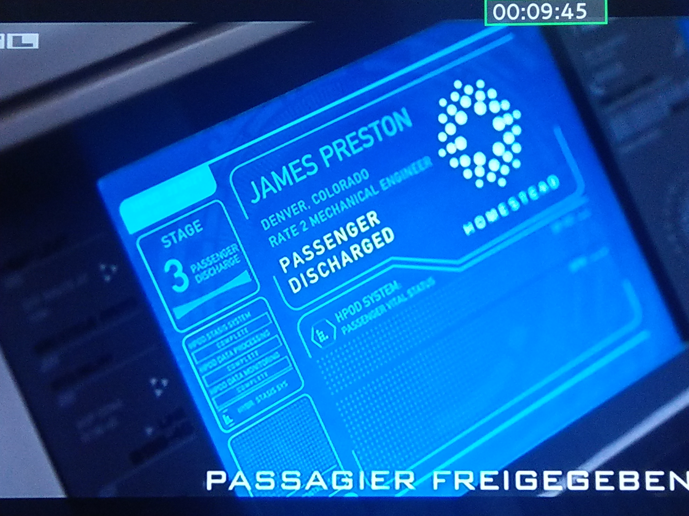
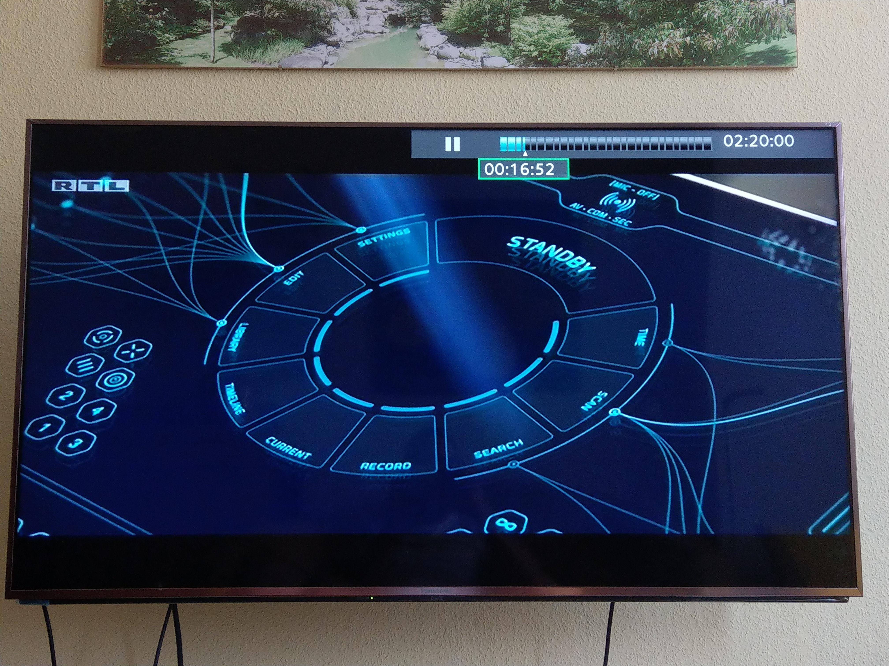
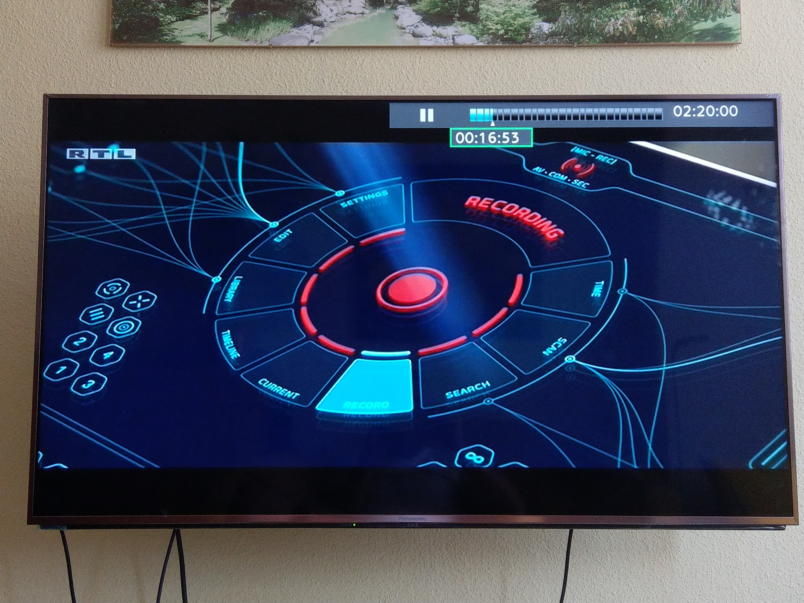
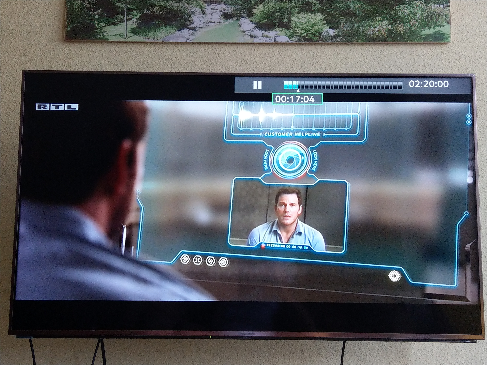
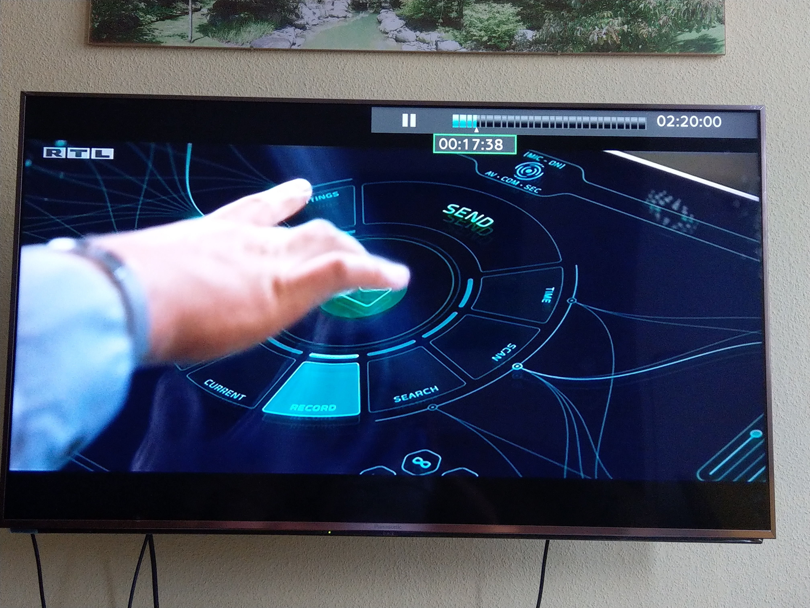
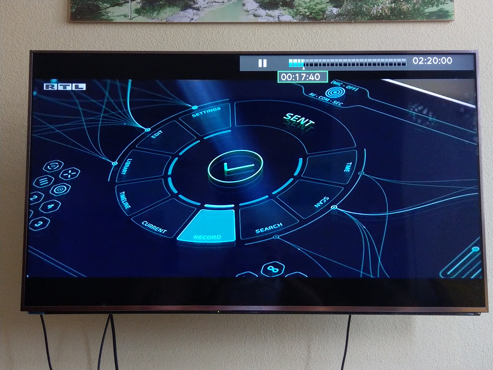
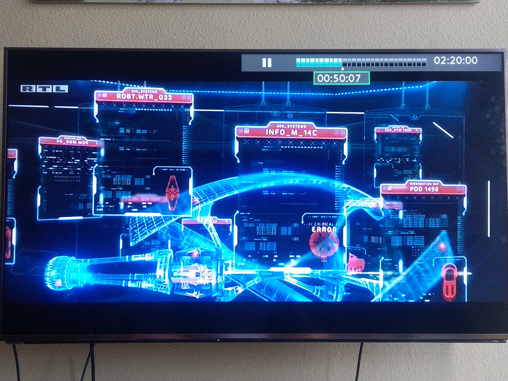
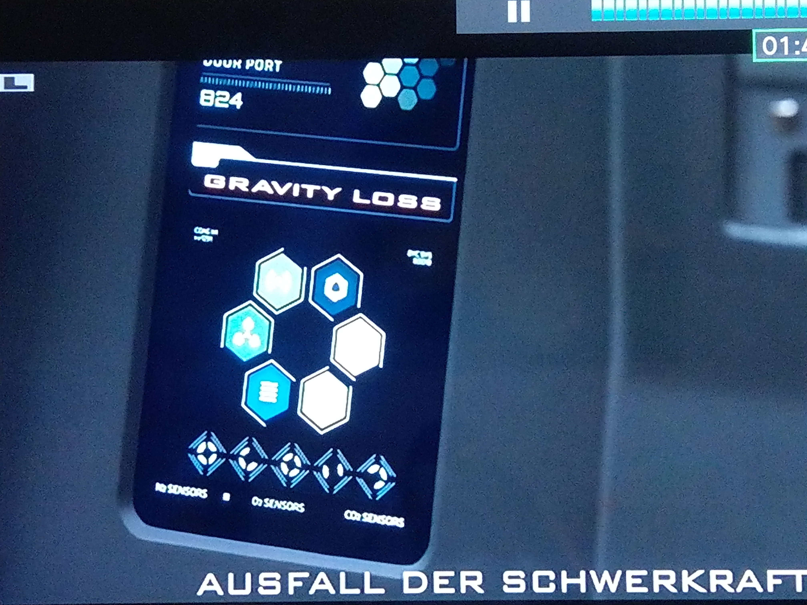
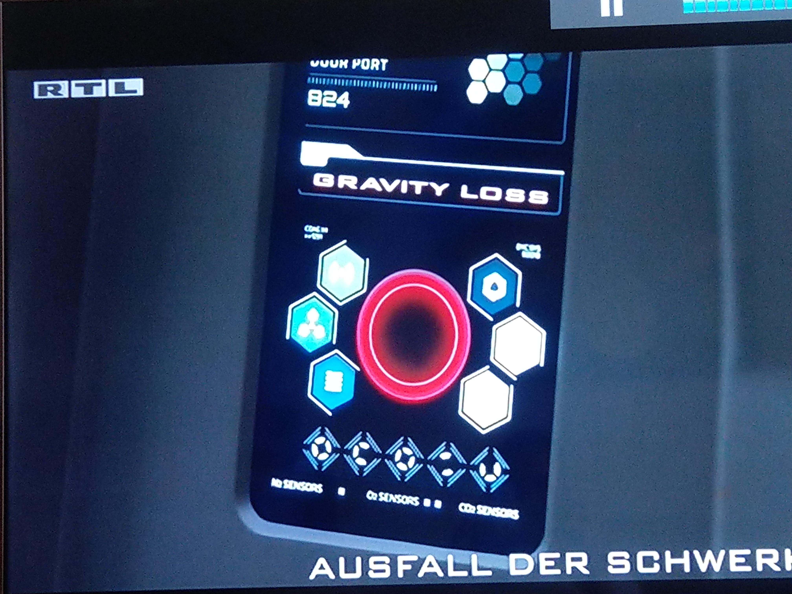

# UX Design

Kleine Arbeitsprobe, wie ich ein Android Frontend entwickle.

Als Beispiel dient das Health-POD Display aus dem Film "Passengers" von Morten Tyldum.

Im Vordergrund steht das Schachteln von Views, um effiziente Wiederverwendbarkeit und Wartbarkeit zu garantieren.

Als 3rd party Hilfen nutze ich hier Android Annotations, EventBus von greenrobot und den SimpleXml Framework.

Hinweis: 
  
  Die Layouts sind NICHT optimiert für große und extra-große Displays (Tablet / TV), wäre aber problemlos machbar.
  
  Getestet wurden nur Smartphones mit verschiedenen Auflösungen.
  
